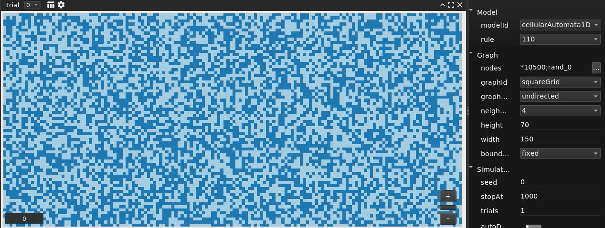
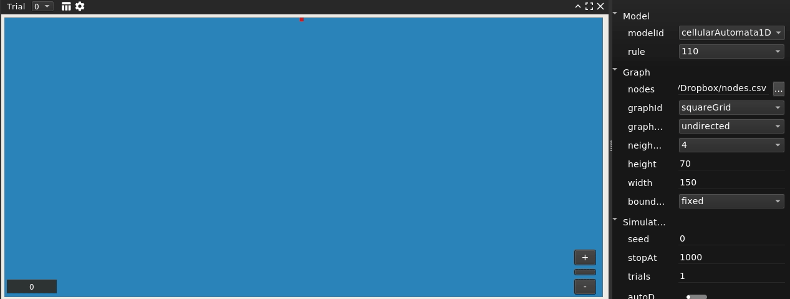

# Cellular Automata 1D Model

## What is it?

This is a model plugin for [Evoplex](https://evoplex.org) and is included by default in the software.

It implements the [elementary cellular automaton rules](http://mathworld.wolfram.com/ElementaryCellularAutomaton.html) 30, 32, 110 and 250.

## How it works

The model runs in a lattice grid, i.e., it uses the `squareGrid` graph generator.

Each cell (node in the graph) can be in one of two possible states: on or off.

Starting from the first row in the graph, at each time step:

- based on the selected rule, compute the next state for each cell in the current row;
- assign the new states to the row below.

## Examples

The figures below were produced using this model in Evoplex.

 
Rule 30: initial population with all cells off (blue) and one on-cell in the first row.

 
Rule 110: random initial population.

 
Rule 110: initial population with all cells off (blue) and one on-cell in the first row.

## References
- [1] Weisstein, Eric W. "Elementary Cellular Automaton." From MathWorld--A Wolfram Web Resource. [http://mathworld.wolfram.com/ElementaryCellularAutomaton.html](http://mathworld.wolfram.com/ElementaryCellularAutomaton.html)
- [2] Weisstein, Eric W. "Rule 30." From MathWorld--A Wolfram Web Resource. [http://mathworld.wolfram.com/Rule30.html](http://mathworld.wolfram.com/Rule30.html)
- [3] Weisstein, Eric W. "Rule 110." From MathWorld--A Wolfram Web Resource. [http://mathworld.wolfram.com/Rule110.html](http://mathworld.wolfram.com/Rule110.html)

## How to cite
If you mention this model or the Evoplex software in a publication, please cite it as:

> Marcos Cardinot, Colm O'Riordan, & Josephine Griffith (2018). Evoplex: an agent-based modeling platform for networks. Zenodo. http://doi.org/10.5281/zenodo.1340734

## License
This plugin is licensed under the [MIT License](https://opensource.org/licenses/MIT) terms.