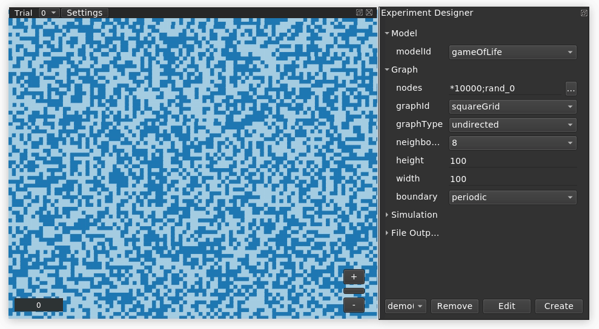

# Conway's Game of Life Model

## What is it?

This is a model plugin for [Evoplex](https://evoplex.org) and is included by default in the software.

It implements [Conway's Game of Life](https://en.wikipedia.org/wiki/Conway's_Game_of_Life) cellular automaton.

## How it works

The model runs in a lattice grid with Moore neighbourhood, i.e., each node interacts with its eight immediate neighbours.

Each node can be in one of two possible states: alive or dead.

At each step in time, each node updates its state based on the following rules:
- If the node is alive and has **less than two live neighbors**: the node dies, as if by underpopulation.
- If the node is alive and has **two or three live neighbors**: the node lives on to the next generation.
- If the node is alive and has **more than three live neighbors**: the node dies, as if by overpopulation.
- If the node is dead and has **exactly three live neighbors**: the node becomes alive, as if by reproduction.

## Examples

The figure below shows a screenshot of an experiment in Evoplex using this model.

<p align="center">

</p>

## How to cite
If you mention this model or the Evoplex software in a publication, please cite it as:

> Cardinot, M., O’Riordan, C., Griffith, J., & Perc, M. (2019). Evoplex: A platform for agent-based modeling on networks. SoftwareX, 9, 199-204. https://doi.org/10.1016/j.softx.2019.02.009

```
@article{Evoplex,
author = "Marcos Cardinot and Colm O’Riordan and Josephine Griffith and Matjaž Perc",
title = "Evoplex: A platform for agent-based modeling on networks",
journal = "SoftwareX",
volume = "9",
pages = "199 - 204",
year = "2019",
issn = "2352-7110",
doi = "10.1016/j.softx.2019.02.009",
url = "http://www.sciencedirect.com/science/article/pii/S2352711018302437"
}
```

## License
This plugin is licensed under the [MIT License](https://opensource.org/licenses/MIT) terms.
