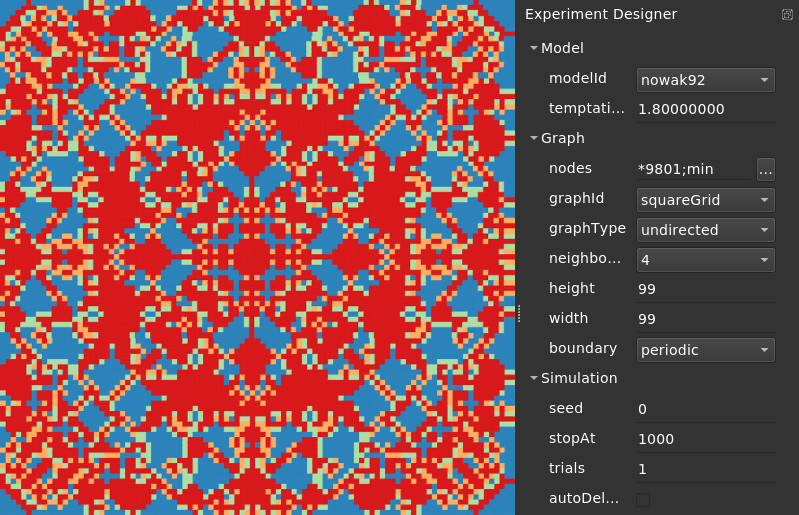

# Evolutionary games and spatial chaos

## What is it?

This is a model plugin for [Evoplex](https://evoplex.org) and is included by default in the software.

It implements the spatial prisoner's dilemma game proposed by Nowak & May (1992) [1].

## How it works

In this model, agents are placed in a grid, where in each round:
- every individual accumulates the payoff obtained by playing the [prisoner's dilemma game](https://en.wikipedia.org/wiki/Prisoner%27s_dilemma) with all its immediate neighbours and itself (only for the current round);
- after this, each agent copies the strategy of the best performing agent in its neighbourhood (including itself).

This simple, and purely deterministic, spatial version of the prisoner's dilemma game, with no memories among players and no strategical elaboration, can generate chaotically changing spatial patterns, including kaleidoscopes, dynamic fractals, gliders, and so on.

## Examples

The figure below shows a screenshot of an experiment in Evoplex using this model. In this experiment, the model is initialized with a population of 99x99 cooperators (i.e., all agents with <i>strategy=0</i>); after this, we place one defector (<i>strategy=1</i>) in the middle of the grid. In a few steps, it is possible to observe the formation of different patterns.

## References
- [1] Nowak, M. A., & May, R. M. (1992). Evolutionary games and spatial chaos. Nature, 359(6398), 826. DOI: [http://dx.doi.org/10.1038/359826a0](http://dx.doi.org/10.1038/359826a0)
- [2] Nowak, M. A., & Sigmund, K. (2004). Evolutionary dynamics of biological games. science, 303(5659), 793-799. DOI: [https://doi.org/10.1126/science.1093411](https://doi.org/10.1126/science.1093411)

## How to cite
If you mention this model or the Evoplex software in a publication, please cite it as:

> Marcos Cardinot, Colm O'Riordan, & Josephine Griffith. (2018). Evoplex: a powerful multi-agent system for networks. Zenodo. http://doi.org/10.5281/zenodo.1340734

## License
This plugin is licensed under the [MIT License](https://opensource.org/licenses/MIT) terms.
