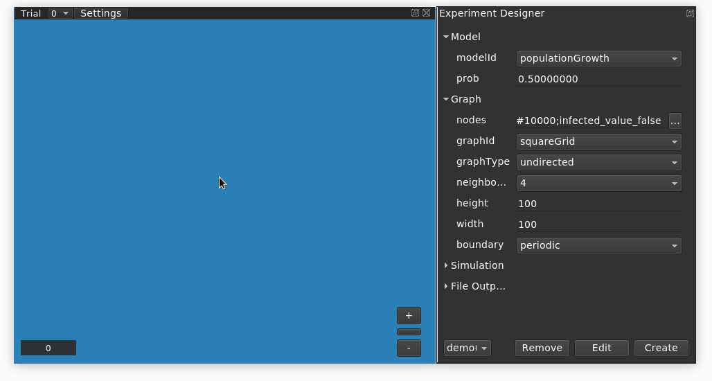

# Population Growth Model

## What is it?

This is a model plugin for [Evoplex](https://evoplex.org) and is included by default in the software.

It implements a simple model to simulate the spread of infection across a population.

## How it works

Issues regarding population dynamics have been studied in a wide range of domains. For instance, biologists may be interested in understanding how the population's growth rate increases over time, while computer scientists may be looking at how information spreads over a network.

Here we implement a very simple population growth scenario in Evoplex. The idea is straightforward, in a population of individuals (nodes), some of them are infected, and some are healthy. A healthy individual becomes infected with a given probability if it interacts with an infected individual in its neighbourhood.

To keep it simple, we consider that the probability of becoming infected is the same for all individuals and does not increase with the number of interactions, i.e., the likelihood of being infected after interacting with one or 100 infected individuals is the same.

Thus, the algorithm can be described as follows:
- at each time step,
  - each healthy node randomly interacts with another node in its neighbourhood
  - if the neighbour is infected, it becomes infected with a given probability

## Examples

The figure below shows a screenshot of an experiment in Evoplex using this model. In this experiment, the model is initialized with a population of 100x100 healthy agents (i.e., all agents with <i>infected=false</i>); after this, we place one infected agent in the middle of the grid.

<p align="center">

</p>

## How to cite
If you mention this model or the Evoplex software in a publication, please cite it as:

> Cardinot, M., O’Riordan, C., Griffith, J., & Perc, M. (2019). Evoplex: A platform for agent-based modeling on networks. SoftwareX, 9, 199-204. https://doi.org/10.1016/j.softx.2019.02.009

```
@article{Evoplex,
author = "Marcos Cardinot and Colm O’Riordan and Josephine Griffith and Matjaž Perc",
title = "Evoplex: A platform for agent-based modeling on networks",
journal = "SoftwareX",
volume = "9",
pages = "199 - 204",
year = "2019",
issn = "2352-7110",
doi = "10.1016/j.softx.2019.02.009",
url = "http://www.sciencedirect.com/science/article/pii/S2352711018302437"
}
```

## License
This plugin is licensed under the [MIT License](https://opensource.org/licenses/MIT) terms.
